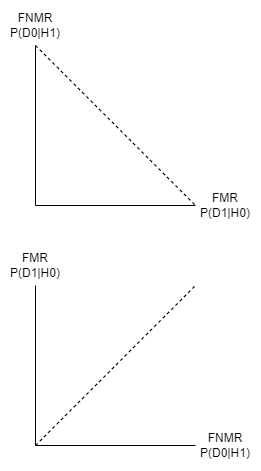

# Week 2: Pattern Recognition and Classificatoin

## Directory
[Home](/README.md#table-of-contents)
- [Week 1: Introduction to Machine Learning in Security](/week1/README.md#Week-1--Introduction-to-Machine-Learning-in-Security)
- **&rarr;[Week 2: Pattern Recognition and Classification](/week2/README.md#week-2-pattern-recognition-and-classificatoin)**

### Overview and What is Pattern Recognition

Input &rarr; Preprocessing &rarr; Feature Processing &rarr; Classification

- Input
  - Fingerprint,
  - face
  - keystroke
  - accelerometer readings
- preprocessing
  - **remove noise**
  - fingerprint reader
  - accelerometer
  - gyroscope
- feature processing
  - rigde points
  - min, max
  - average in a window during accelerometer readings
- classification
  - binary yes/no
  - multiple classes

### Example

- camera to classify aminals vs people
- $x_1$ height
- $x_2$ breadth

$$
X=\begin{bmatrix}
x_1\\
x_2
\end{bmatrix}=
\begin{bmatrix}
height\\
breadth
\end{bmatrix}
$$

### Learning or Training
- two types, but there are many versions
- supervised
- inferring a function from labeled data
  - input-output
  - example: decision tree, artificial neural network, and so on
- unsupervised
- inferring a function from unlabeled data
  - examples are unlabeled
  - example: clustering, Hebbian learning

- inductive step
- deductive step

- eager learners - classify as soon as data is available
- lazy learners - postpone classification until 
  - k-nn (k nearest neighbors)

### Example

- supervised lerning: selection of weights in a perceptron
- unsupervised learning: clustering
  - mean clustering
  - $||(Z-X)||\leq$

### Stages in a Biometric system

Typically a biometric system goes through two phases
- enrollment
  - template training
- verification or identification
  - verification - yes/no 1:1
  - identification - who are you 1:many

### Typical pattern-recognition system 

Enrollment or registration
Face image, fingerprint, PIN, name&rarr;quality check&rarr;feature processing&rarr;database

Use a template for the identification and is stored in a database
### Example of a pattern recognition system

- finger swiping on phone
- feature extraction
  - velocity
  - area
  - pressure
  - acceleration
- derived features
  - mrean
  - standard deviation
  - quartiles
  - coordinates of start/end points
  - summation of diatances betweene very pair of touch points
  - angle between end-to-end line and the horizontal
  - distance between end points

### Types of errors
- Type 1: false match ($D_1$ is descided when $H_0$ is true)
  - false positive
- Type 2: false nonmatch ($D_0$ is decided when $H_1$ is true)
  - flase negatives
- FMR (false match rate): probability of type 1 error = $P(D_1|H_0)$
- FNMR (false non match rate): probability of type 2 error = $P(D_0|H_1)$

$D_0$ the person is **NOT** who she claims
$D_1$ the person **IS** who she claims

FMR vs FNMR (maybe?)
